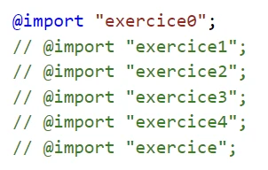

# Exercice Media-Queries

## Étape 1 : Chaque format individuellement

1. Dans le fichier `style.scss`, mettre en commentaire tous les import de la fin SAUF le premier.
   
2. Faire en sorte que la page ressemble au résultat  "Largeur de 422px" du fichier `_assets/resultat.html`.
3. Décommenter la ligne suivante __SANS__ commenter la première.
4. Adapter la page.
5. Continuer jusqu'à `exercice4`.
	

   